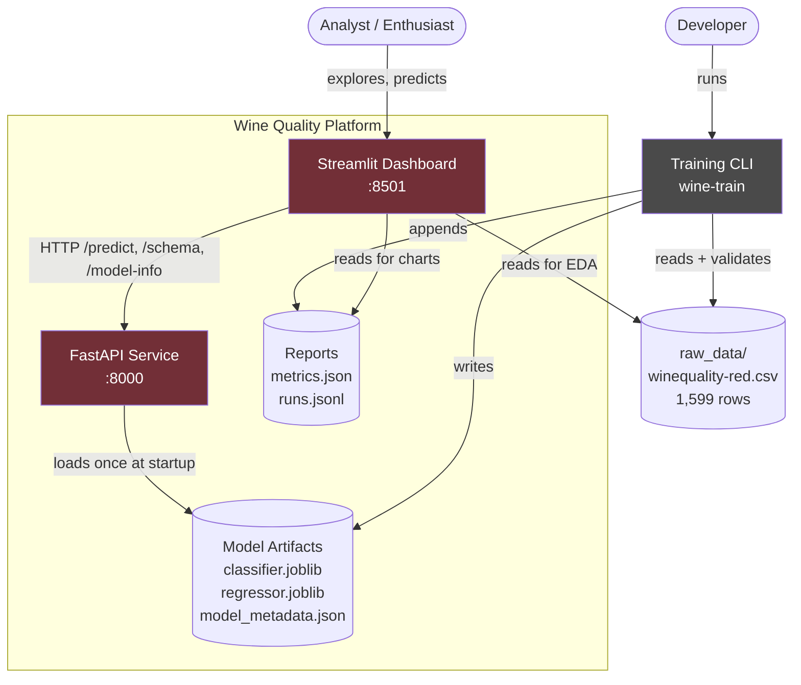
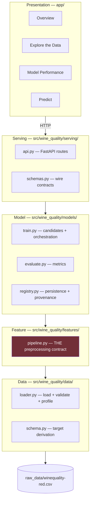
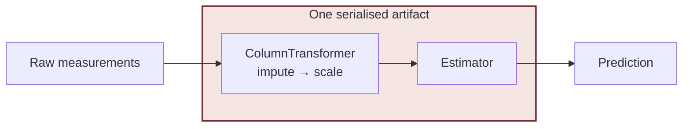
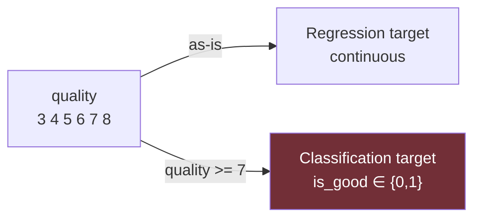
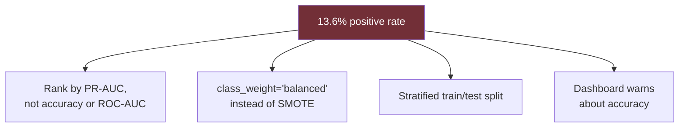
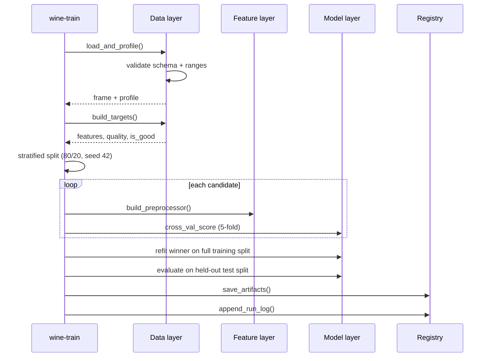
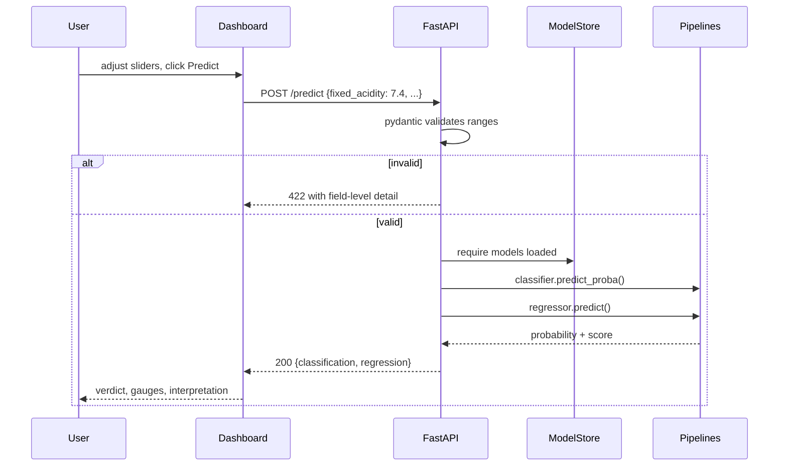
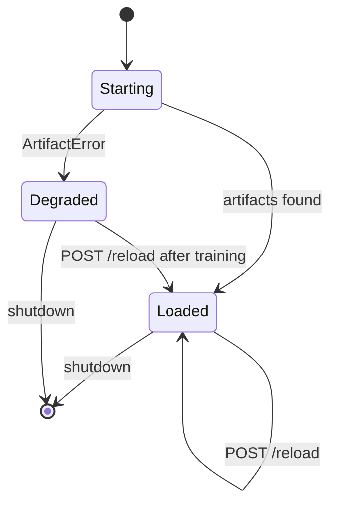
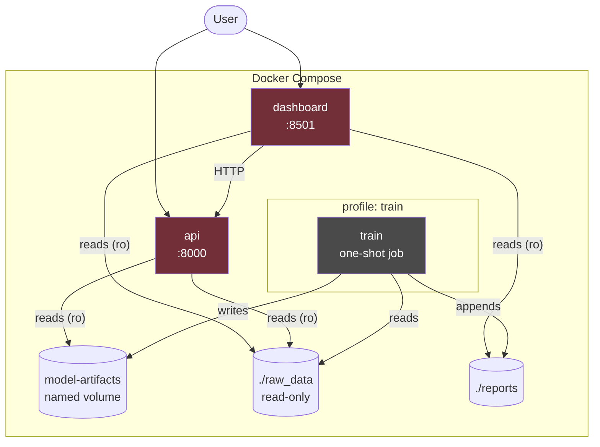

# Architecture — Wine Quality ML Platform

Design document for a machine-learning system that predicts red wine quality
from physicochemical measurements, based on the dataset from Cortez et al.
(2009).

**Status:** implemented and verified. See [`README.md`](README.md) for usage.

---

## 1. Objective and scope

### The question

The dataset's stated inspiration is:

> *"Use machine learning to determine which physiochemical properties make a
> wine 'good'!"*

This project answers that question with a served model, an interactive
dashboard, and a reproducible training pipeline — not a notebook.

### Two tasks, one dataset

The original authors note the data supports both framings, so both are
implemented:

| Task | Target | Question answered | Primary metric |
|---|---|---|---|
| **Classification** | `is_good` = `quality ≥ 7` | Is this wine good? | **PR-AUC** |
| **Regression** | `quality` (3–8) | What score will it get? | RMSE |

They are fitted separately and can disagree. That disagreement is informative:
the score places a wine on the original sensory scale, while the probability
expresses confidence that it clears the cutoff.

### In scope

- Data validation, profiling, and target derivation
- Cross-validated model selection over three candidates per task
- Serialised pipelines served over HTTP
- A four-page interactive dashboard
- Containerised deployment with a reproducible training stage
- A four-tier test suite

### Out of scope

- White wine data (a separate dataset)
- Authentication, authorisation, rate limiting
- A database (the dataset is 100 KB and static)
- Cloud deployment and autoscaling
- Automated retraining triggers
- Hyperparameter search as a service

---

## 2. System context



**Key boundary:** the dashboard never imports the models. It talks to the API
over HTTP, so the service boundary is exercised for real rather than being
decorative.

---

## 3. Layered architecture



### Dependency rule

Dependencies point **downward only**. A layer may import from the layer beneath
it, never above. This is what keeps the model layer testable without a running
API, and the feature layer testable without a trained model.

| Layer | Responsibility | May import |
|---|---|---|
| **Presentation** | Render UI, collect input, display results | Serving (over HTTP), Data (read-only), Config |
| **Serving** | HTTP contract, request validation, model lifecycle | Model, Feature, Data, Config |
| **Model** | Candidate definition, selection, evaluation, persistence | Feature, Data, Config |
| **Feature** | Transform raw measurements into model input | Data, Config |
| **Data** | Load, validate, profile, derive targets | Config |

### The critical design decision

**Preprocessing lives inside the serialised pipeline.**



The `ColumnTransformer` is fitted during training and saved *with* the
estimator. At inference, the exact transformation the model was trained on is
replayed. Train/serve skew becomes **structurally impossible** rather than
merely discouraged — there is no second implementation for production to drift
away from.

This is why `tests/test_features.py` is the most important test file: any change
to the preprocessor silently changes what production computes.

---

## 4. Repository layout

```
DeepseekV4.1/
├── raw_data/
│   └── winequality-red.csv          # Source data — never modified
│
├── src/wine_quality/
│   ├── config.py                    # Settings, feature schema, bounds, paths
│   ├── data/
│   │   ├── loader.py                # Load, validate, profile
│   │   └── schema.py                # Target derivation (both tasks)
│   ├── features/
│   │   └── pipeline.py              # THE shared preprocessing contract
│   ├── models/
│   │   ├── train.py                 # Candidates, selection, CLI entrypoint
│   │   ├── evaluate.py              # Classification + regression metrics
│   │   └── registry.py              # Artifact persistence, provenance, run log
│   └── serving/
│       ├── api.py                   # FastAPI app, model store, routes
│       └── schemas.py               # Pydantic wire contracts
│
├── app/                             # Streamlit dashboard
│   ├── api_client.py                # HTTP client — no in-process imports
│   ├── Overview.py                  # Landing page
│   └── pages/
│       ├── 1_Explore_the_Data.py    # EDA
│       ├── 2_Model_Performance.py   # Evaluation detail
│       └── 3_Predict.py             # Interactive prediction
│
├── tests/
│   ├── conftest.py                  # Shared fixtures
│   ├── test_data.py                 # Schema, validation, targets
│   ├── test_features.py             # Preprocessing contract
│   ├── test_models.py               # Metrics, artifacts, end-to-end training
│   └── test_api.py                  # HTTP contract
│
├── models/                          # Generated artifacts (gitignored)
├── reports/                         # metrics.json, runs.jsonl (gitignored)
│
├── Dockerfile                       # Multi-stage: base → builder → runtime → training
├── docker-compose.yml               # api + dashboard + profile-gated train
├── pyproject.toml                   # uv, ruff, pytest config
├── Makefile                         # Developer tasks
├── ARCHITECTURE.md                  # This document
└── README.md                        # Usage guide
```

---

## 5. Data contract

### Source

| Property | Value |
|---|---|
| File | `raw_data/winequality-red.csv` |
| Rows | 1,599 |
| Columns | 12 (11 features + 1 target) |
| Missing values | 0 |
| Duplicate rows | 240 (retained — genuine repeated measurements) |
| License | ODbL / DbCL |

### Columns

Feature order is **pinned** in `config.FEATURE_NAMES`. It defines the column
order the API expects and the order the `ColumnTransformer` sees. Changing it
invalidates trained artifacts.

| # | Column | Type | Plausible range | Description |
|---|---|---|---|---|
| 1 | `fixed acidity` | float | 2.0 – 20.0 | Tartaric acid (g/dm³) |
| 2 | `volatile acidity` | float | 0.0 – 2.5 | Acetic acid (g/dm³) — high values cause vinegar taste |
| 3 | `citric acid` | float | 0.0 – 1.5 | Citric acid (g/dm³) — adds freshness |
| 4 | `residual sugar` | float | 0.0 – 30.0 | Sugar after fermentation (g/dm³) |
| 5 | `chlorides` | float | 0.0 – 1.0 | Sodium chloride (g/dm³) |
| 6 | `free sulfur dioxide` | float | 0.0 – 150.0 | Free SO₂ (mg/dm³) |
| 7 | `total sulfur dioxide` | float | 0.0 – 400.0 | Total SO₂ (mg/dm³) |
| 8 | `density` | float | 0.98 – 1.01 | Density (g/cm³) |
| 9 | `pH` | float | 2.5 – 4.5 | Acidity on the 0–14 scale |
| 10 | `sulphates` | float | 0.0 – 3.0 | Potassium sulphate (g/dm³) |
| 11 | `alcohol` | float | 7.0 – 16.0 | Alcohol content (% vol.) |
| 12 | `quality` | int | 3 – 8 | **Target** — sensory score |

Ranges are the training distribution widened by a safety margin, so the API
rejects only clearly impossible measurements rather than unusual-but-valid wines.

### Target derivation



### Observed distribution

| Quality | Count | Share |
|---|---:|---:|
| 3 | 10 | 0.6% |
| 4 | 53 | 3.3% |
| 5 | 681 | 42.6% |
| 6 | 638 | 39.9% |
| 7 | 199 | 12.4% |
| 8 | 18 | 1.1% |
| **≥ 7 ("good")** | **217** | **13.6%** |

### The central constraint: imbalance

Only **13.6%** of wines are "good" — a **6.4:1** ratio. This drives several
design decisions:



A model predicting "never good" scores **86.4% accuracy while finding zero good
wines**. Accuracy and ROC-AUC both hide this failure; average precision does not.

---

## 6. Modeling design

### Candidate selection

Three candidates per task, all wrapped in the *same* preprocessing pipeline so
comparison isolates the estimator rather than conflating it with differing
feature handling.

| Task | Candidates | Selection metric |
|---|---|---|
| Classification | LogisticRegression, RandomForest, GradientBoosting | CV average precision |
| Regression | Ridge, RandomForest, GradientBoosting | CV neg RMSE |

Linear models get a `StandardScaler`; trees skip it (harmless but wasteful).

### Training flow



**Selection discipline:** candidates are ranked on the *training* split only.
The test split is touched once, after selection, so reported metrics are not
optimistically biased.

### Verified results

| Metric | Value | Note |
|---|---:|---|
| **ROC-AUC** | **0.942** | Kaggle card suggests ~0.88 is achievable without tuning |
| **PR-AUC** ★ | **0.848** | Primary metric |
| F1 | 0.727 | At the 0.5 threshold |
| Accuracy | 0.925 | Misleading — see imbalance |
| Recall (good) | 0.744 | Minority-class coverage |
| RMSE | 0.604 | In quality-score units |
| MAE | 0.438 | In quality-score units |
| R² | 0.504 | Variance explained |

Selected: **RandomForestClassifier** and **RandomForestRegressor**.

### Answering the inspiration question

Feature importances from the fitted classifier answer *"which physicochemical
properties make a wine good?"* — `alcohol` is consistently strongest, followed
by `volatile acidity` and `sulphates`, matching the domain literature.

These are **correlations, not causes**. The dataset card explicitly warns
against causal readings, and the dashboard repeats that warning.

---

## 7. Artifact contract

Three files, written together, read together:

| Artifact | Format | Contents |
|---|---|---|
| `models/classifier.joblib` | joblib | Fitted pipeline: preprocessor + classifier |
| `models/regressor.joblib` | joblib | Fitted pipeline: preprocessor + regressor |
| `models/model_metadata.json` | JSON | Provenance and held-out metrics |

### Metadata schema

```json
{
  "model_version": "0.1.0",
  "trained_at": "2026-09-15T11:15:09+00:00",
  "good_quality_cutoff": 7,
  "feature_names": ["fixed acidity", "..."],
  "n_training_rows": 1279,
  "n_test_rows": 320,
  "classifier_algorithm": "RandomForestClassifier",
  "regressor_algorithm": "RandomForestRegressor",
  "classification_metrics": { "roc_auc": 0.9418, "average_precision": 0.8478 },
  "regression_metrics": { "rmse": 0.6037, "r2": 0.5041 },
  "sklearn_version": "1.9.1",
  "python_version": "3.13.12"
}
```

The API reads this file to describe itself, so a model binary can never be
served without its provenance being available. `feature_names` makes a schema
mismatch detectable rather than silent.

### Experiment log

`reports/runs.jsonl` — append-only, one JSON object per training run.

A deliberately minimal substitute for a tracking server: the dataset is tiny and
runs are infrequent, so a newline-delimited file that `git diff` can read is more
useful than operational overhead. The trade-off is documented rather than hidden.

---

## 8. Serving layer

### Endpoints

| Method | Path | Purpose | Auth |
|---|---|---|---|
| `GET` | `/health` | Liveness + model readiness | — |
| `GET` | `/model-info` | Provenance and held-out metrics | — |
| `GET` | `/schema` | Feature names, ranges, descriptions | — |
| `POST` | `/predict` | Both tasks in one call | — |
| `POST` | `/predict/classification` | Binary verdict only | — |
| `POST` | `/predict/regression` | Quality score only | — |
| `POST` | `/reload` | Re-read artifacts without restart | — |

### Request schema

Generated dynamically from `FEATURE_NAMES` and `FEATURE_BOUNDS`, so adding a
feature to config cannot silently omit it from the API. Field names use
underscores (`fixed_acidity`) while the CSV uses spaces (`fixed acidity`); the
mapping is handled internally.

### Prediction flow



### Model lifecycle



**Degraded is a deliberate state.** If artifacts are missing, the process still
starts so `/health` can report the problem instead of crash-looping — which
makes the failure far easier to diagnose from `docker compose ps`.

### Determinism

Inference forces `n_jobs=1` on tree ensembles. Tree averaging uses a parallel
reduction, and floating-point addition is not associative, so `n_jobs=-1` makes
repeated identical requests differ in the last bit (~1e-16). Training benefits
from parallelism; scoring one row does not, and reproducible predictions matter
for caching, auditing, and debugging.

---

## 9. Presentation layer

Four pages, each with a distinct job:

| Page | Data source | Purpose |
|---|---|---|
| **Overview** | CSV + API | Dataset shape, imbalance story, served-model metrics, feature importance |
| **Explore the Data** | CSV only | Distributions, correlations, good-vs-bad comparison, raw table |
| **Model Performance** | Artifacts + API | ROC/PR curves, confusion matrix, residuals, candidate comparison |
| **Predict** | API only | Slider form → verdict, gauges, interpretation |

**Why the split?** Static reference data (the CSV) is read directly — a network
round-trip would add latency without adding truth. Anything about the *model*
goes through the API, so a broken API surfaces as a visible dashboard error
instead of being masked by a working local import.

The Predict page builds its form from `/schema`, so the UI cannot drift out of
sync with what the model expects.

---

## 10. Deployment topology



### Services

| Service | Image stage | Port | Depends on | Restart |
|---|---|---|---|---|
| `train` | `training` | — | — | `no` (one-shot) |
| `api` | `runtime` | 8000 | — | `unless-stopped` |
| `dashboard` | `runtime` | 8501 | `api` (healthy) | `unless-stopped` |

### Why training is profile-gated

`docker compose up` should be fast for demos. Training cross-validates six
pipelines, so it is opt-in via `--profile train` while remaining fully
reproducible:

```bash
docker compose --profile train up --build   # train, then serve
docker compose up                           # serve only
```

### Volume strategy

| Volume | Mount | Mode | Rationale |
|---|---|---|---|
| `model-artifacts` | `/app/models` | `ro` for API | The API must never write to the artifact store |
| `./raw_data` | `/app/raw_data` | `ro` | Source data is immutable |
| `./reports` | `/app/reports` | `ro` for dashboard | Reports are training output, not UI state |

### Image design

Multi-stage build: `base` → `builder` → `runtime` → `training`.

- `uv` copied from its official image rather than pip-installed — reproducible,
  no bootstrap dependency on PyPI
- Dependency layer cached independently of source changes
- Runtime stage has no compilers and runs as non-root (`appuser`, uid 1001)
- Healthchecks on both long-running services

---

## 11. Configuration

Every setting is overridable via environment variables with the `WINE_` prefix.
No module hardcodes paths, thresholds, or hyperparameters.

| Variable | Default | Purpose |
|---|---|---|
| `WINE_GOOD_QUALITY_CUTOFF` | `7` | Score at or above which a wine is "good" |
| `WINE_TEST_SIZE` | `0.2` | Held-out fraction |
| `WINE_RANDOM_STATE` | `42` | Seed for splits and estimators |
| `WINE_CV_FOLDS` | `5` | Cross-validation folds |
| `WINE_CLASS_WEIGHT` | `balanced` | Imbalance mitigation |
| `WINE_PRIMARY_METRIC` | `average_precision` | Classifier selection metric |
| `WINE_API_BASE_URL` | `http://localhost:8000` | Dashboard → API URL |
| `WINE_API_PORT` | `8000` | API port |
| `WINE_API_TIMEOUT_SECONDS` | `10.0` | HTTP timeout |
| `API_PORT` | `8000` | Host port mapping |
| `DASHBOARD_PORT` | `8501` | Host port mapping |

```bash
# Try a stricter definition of "good"
WINE_GOOD_QUALITY_CUTOFF=8 make train
```

---

## 12. Testing strategy

Four tiers, each targeting a different failure mode.

| Tier | File | Guards against | Count |
|---|---|---|---|
| Data | `test_data.py` | Schema drift, corrupted CSVs, wrong target derivation | 24 |
| Feature | `test_features.py` | Preprocessing changes that would silently alter production | 40 |
| Model | `test_models.py` | Metric bugs, artifact round-trip failures, weak models | 33 |
| API | `test_api.py` | Contract violations, validation gaps, non-determinism | 27 |

**Coverage: 93%** · **124 tests passing**

### Notable test choices

- **`test_features.py` is the most important file.** Because the preprocessor is
  serialised into the model, any change there changes what production computes.
  These tests pin the behaviour explicitly.
- **Model quality is asserted, not just correctness.** `test_classifier_beats_random_baseline`
  requires ROC-AUC > 0.80 and `test_classifier_beats_no_skill_pr_baseline`
  requires PR-AUC > 0.40, so a regression in model quality fails the build.
- **Domain knowledge is encoded.** `test_alcohol_is_a_top_predictor` asserts
  alcohol ranks in the top three, catching a silently misaligned feature matrix.
- **Directional sanity checks.** `test_high_alcohol_scores_higher_than_low`
  verifies the API responds in the physically expected direction.
- **The `slow` marker** isolates the end-to-end training test, so
  `pytest -m "not slow"` gives a fast feedback loop.

---

## 13. Verification and acceptance criteria

| Criterion | How verified | Result |
|---|---|---|
| Dataset loads and validates | `test_data.py` | ✅ 1,599 × 12 |
| Both targets derive correctly | `test_data.py` | ✅ 13.6% positive |
| Preprocessing is deterministic | `test_features.py` | ✅ |
| Classifier beats baseline | `test_models.py` | ✅ ROC-AUC 0.942 |
| Regressor beats the mean | `test_models.py` | ✅ R² 0.504 |
| Artifacts round-trip exactly | `test_models.py` | ✅ |
| API contract holds | `test_api.py` | ✅ 27 tests |
| Predictions are reproducible | `test_api.py` | ✅ after `n_jobs=1` fix |
| Lint is clean | `ruff check .` | ✅ |
| API serves live | `curl` against running server | ✅ |
| Dashboard renders all pages | Browser verification | ✅ |
| End-to-end prediction works | Browser: median wine → 5.69, 5.1% | ✅ |

---

## 14. Build roadmap


| Phase | Deliverable | Status |
|---|---|---|
| 0 | `pyproject.toml`, package skeleton, config, `.gitignore` | ✅ |
| 1 | Data loading/validation, target derivation, preprocessing contract | ✅ |
| 2 | Candidates, cross-validated selection, metrics, artifact registry | ✅ |
| 3 | FastAPI app, wire schemas, model store, health/reload | ✅ |
| 4 | Four-page Streamlit dashboard with API client | ✅ |
| 5 | Multi-stage Dockerfile, compose, Makefile, tests, docs | ✅ |

### Future work

| Idea | Value | Cost |
|---|---|---|
| Threshold tuning for a target precision/recall | Better business fit | Low |
| Probability calibration (isotonic/Platt) | Trustworthy confidence | Low |
| SHAP explanations per prediction | Local interpretability | Medium |
| White wine dataset for comparison | Broader coverage | Medium |
| MLflow tracking | Richer experiment history | Medium |
| CI pipeline (GitHub Actions) | Automated quality gates | Low |
| Model monitoring for drift | Production readiness | High |

---

## 15. Known limitations

- **Regression to the mean.** The regressor rarely predicts extreme scores (3 or
  8) because few such wines exist. Predictions cluster in the 5–6 range.
- **R² is modest (0.504).** Most quality variation is driven by factors this
  dataset does not capture — grape variety, vintage, winemaking technique.
- **No causal claims.** Feature importances are statistical associations.
- **Red wine only.** The white wine dataset is not included.
- **No authentication.** Intended for local or trusted-network use.
- **240 duplicate rows retained.** They are genuine repeated measurements, not
  data-entry errors, so removing them would discard real information. The
  effective sample size is simply smaller than 1,599 suggests.
- **Fixed decision threshold.** `P(good) ≥ 0.5` is hardcoded. A production system
  would tune this against the relative cost of false positives and negatives.

---

## 16. References

Cortez, P., Cerdeira, A., Almeida, F., Matos, T., & Reis, J. (2009). Modeling
wine preferences by data mining from physicochemical properties. *Decision
Support Systems*, 47(4), 547–553.

```bibtex
@article{cortez2009modeling,
  title   = {Modeling wine preferences by data mining from physicochemical properties},
  author  = {Cortez, Paulo and Cerdeira, Ant{\'o}nio and Almeida, Fernando and Matos, Telmo and Reis, Jos{\'e}},
  journal = {Decision Support Systems},
  volume  = {47},
  number  = {4},
  pages   = {547--553},
  year    = {2009},
  doi     = {10.1016/j.dss.2009.05.016}
}
```

- Dataset: <https://www.kaggle.com/datasets/uciml/red-wine-quality-cortez-et-al-2009>
- UCI repository: <https://archive.ics.uci.edu/ml/datasets/wine+quality>
- License: [ODbL / DbCL](http://opendatacommons.org/licenses/dbcl/1.0/)